## The purpose of this project is to predict sales for certain products of interest (PCs, Laptops, Netbooks, Smartphones) for an Electronics Retailer and assess the impact 'Service Reviews' and 'Customer Reviews' have on sales.

## The following shows my entire data and machine learning process.

## To see sales predictions only...simply scroll all the way down.

#### Loading packages

```r
library(tidyverse)
library(caret)
library(ggplot2)
library(corrplot)
library(openxlsx)
library(h2o)
library(kableExtra)
```

#### Importing data (path has been hidden)


#### Checking structure

```r
str(existing)
```

```
## 'data.frame':	80 obs. of  18 variables:
##  $ ProductType          : Factor w/ 12 levels "Accessories",..: 7 7 7 5 5 1 1 1 1 1 ...
##  $ ProductNum           : int  101 102 103 104 105 106 107 108 109 110 ...
##  $ Price                : num  949 2250 399 410 1080 ...
##  $ x5StarReviews        : int  3 2 3 49 58 83 11 33 16 10 ...
##  $ x4StarReviews        : int  3 1 0 19 31 30 3 19 9 1 ...
##  $ x3StarReviews        : int  2 0 0 8 11 10 0 12 2 1 ...
##  $ x2StarReviews        : int  0 0 0 3 7 9 0 5 0 0 ...
##  $ x1StarReviews        : int  0 0 0 9 36 40 1 9 2 0 ...
##  $ PositiveServiceReview: int  2 1 1 7 7 12 3 5 2 2 ...
##  $ NegativeServiceReview: int  0 0 0 8 20 5 0 3 1 0 ...
##  $ Recommendproduct     : num  0.9 0.9 0.9 0.8 0.7 0.3 0.9 0.7 0.8 0.9 ...
##  $ BestSellersRank      : int  1967 4806 12076 109 268 64 NA 2 NA 18 ...
##  $ ShippingWeight       : num  25.8 50 17.4 5.7 7 1.6 7.3 12 1.8 0.75 ...
##  $ ProductDepth         : num  23.9 35 10.5 15 12.9 ...
##  $ ProductWidth         : num  6.62 31.75 8.3 9.9 0.3 ...
##  $ ProductHeight        : num  16.9 19 10.2 1.3 8.9 ...
##  $ ProfitMargin         : num  0.15 0.25 0.08 0.08 0.09 0.05 0.05 0.05 0.05 0.05 ...
##  $ Volume               : int  12 8 12 196 232 332 44 132 64 40 ...
```

#### We can see that one feature of interest, 'Product Type,' is a factor with 12 categorical values (12 different product types, such as 'Accessories,' 'Laptops,' etc.). Because regression algorithms can easily misinterpret categorical variables with more than 2 values, we will 'dummify' this feature for regression modeling to binarize the values.

```r
existingDummy <- dummyVars(' ~ .', data = existing)
existing2 <- data.frame(predict(existingDummy, newdata = existing))
```

#### Checking structure again

```r
str(existing2)
```

```
## 'data.frame':	80 obs. of  29 variables:
##  $ ProductType.Accessories     : num  0 0 0 0 0 1 1 1 1 1 ...
##  $ ProductType.Display         : num  0 0 0 0 0 0 0 0 0 0 ...
##  $ ProductType.ExtendedWarranty: num  0 0 0 0 0 0 0 0 0 0 ...
##  $ ProductType.GameConsole     : num  0 0 0 0 0 0 0 0 0 0 ...
##  $ ProductType.Laptop          : num  0 0 0 1 1 0 0 0 0 0 ...
##  $ ProductType.Netbook         : num  0 0 0 0 0 0 0 0 0 0 ...
##  $ ProductType.PC              : num  1 1 1 0 0 0 0 0 0 0 ...
##  $ ProductType.Printer         : num  0 0 0 0 0 0 0 0 0 0 ...
##  $ ProductType.PrinterSupplies : num  0 0 0 0 0 0 0 0 0 0 ...
##  $ ProductType.Smartphone      : num  0 0 0 0 0 0 0 0 0 0 ...
##  $ ProductType.Software        : num  0 0 0 0 0 0 0 0 0 0 ...
##  $ ProductType.Tablet          : num  0 0 0 0 0 0 0 0 0 0 ...
##  $ ProductNum                  : num  101 102 103 104 105 106 107 108 109 110 ...
##  $ Price                       : num  949 2250 399 410 1080 ...
##  $ x5StarReviews               : num  3 2 3 49 58 83 11 33 16 10 ...
##  $ x4StarReviews               : num  3 1 0 19 31 30 3 19 9 1 ...
##  $ x3StarReviews               : num  2 0 0 8 11 10 0 12 2 1 ...
##  $ x2StarReviews               : num  0 0 0 3 7 9 0 5 0 0 ...
##  $ x1StarReviews               : num  0 0 0 9 36 40 1 9 2 0 ...
##  $ PositiveServiceReview       : num  2 1 1 7 7 12 3 5 2 2 ...
##  $ NegativeServiceReview       : num  0 0 0 8 20 5 0 3 1 0 ...
##  $ Recommendproduct            : num  0.9 0.9 0.9 0.8 0.7 0.3 0.9 0.7 0.8 0.9 ...
##  $ BestSellersRank             : num  1967 4806 12076 109 268 ...
##  $ ShippingWeight              : num  25.8 50 17.4 5.7 7 1.6 7.3 12 1.8 0.75 ...
##  $ ProductDepth                : num  23.9 35 10.5 15 12.9 ...
##  $ ProductWidth                : num  6.62 31.75 8.3 9.9 0.3 ...
##  $ ProductHeight               : num  16.9 19 10.2 1.3 8.9 ...
##  $ ProfitMargin                : num  0.15 0.25 0.08 0.08 0.09 0.05 0.05 0.05 0.05 0.05 ...
##  $ Volume                      : num  12 8 12 196 232 332 44 132 64 40 ...
```

#### Checking summary for descriptive statistics and NAs

```r
summary(existing2)
```

```
##  ProductType.Accessories ProductType.Display ProductType.ExtendedWarranty
##  Min.   :0.000           Min.   :0.0000      Min.   :0.000               
##  1st Qu.:0.000           1st Qu.:0.0000      1st Qu.:0.000               
##  Median :0.000           Median :0.0000      Median :0.000               
##  Mean   :0.325           Mean   :0.0625      Mean   :0.125               
##  3rd Qu.:1.000           3rd Qu.:0.0000      3rd Qu.:0.000               
##  Max.   :1.000           Max.   :1.0000      Max.   :1.000               
##                                                                          
##  ProductType.GameConsole ProductType.Laptop ProductType.Netbook ProductType.PC
##  Min.   :0.000           Min.   :0.0000     Min.   :0.000       Min.   :0.00  
##  1st Qu.:0.000           1st Qu.:0.0000     1st Qu.:0.000       1st Qu.:0.00  
##  Median :0.000           Median :0.0000     Median :0.000       Median :0.00  
##  Mean   :0.025           Mean   :0.0375     Mean   :0.025       Mean   :0.05  
##  3rd Qu.:0.000           3rd Qu.:0.0000     3rd Qu.:0.000       3rd Qu.:0.00  
##  Max.   :1.000           Max.   :1.0000     Max.   :1.000       Max.   :1.00  
##                                                                               
##  ProductType.Printer ProductType.PrinterSupplies ProductType.Smartphone
##  Min.   :0.00        Min.   :0.0000              Min.   :0.00          
##  1st Qu.:0.00        1st Qu.:0.0000              1st Qu.:0.00          
##  Median :0.00        Median :0.0000              Median :0.00          
##  Mean   :0.15        Mean   :0.0375              Mean   :0.05          
##  3rd Qu.:0.00        3rd Qu.:0.0000              3rd Qu.:0.00          
##  Max.   :1.00        Max.   :1.0000              Max.   :1.00          
##                                                                        
##  ProductType.Software ProductType.Tablet   ProductNum        Price        
##  Min.   :0.000        Min.   :0.0000     Min.   :101.0   Min.   :   3.60  
##  1st Qu.:0.000        1st Qu.:0.0000     1st Qu.:120.8   1st Qu.:  52.66  
##  Median :0.000        Median :0.0000     Median :140.5   Median : 132.72  
##  Mean   :0.075        Mean   :0.0375     Mean   :142.6   Mean   : 247.25  
##  3rd Qu.:0.000        3rd Qu.:0.0000     3rd Qu.:160.2   3rd Qu.: 352.49  
##  Max.   :1.000        Max.   :1.0000     Max.   :200.0   Max.   :2249.99  
##                                                                           
##  x5StarReviews    x4StarReviews    x3StarReviews    x2StarReviews   
##  Min.   :   0.0   Min.   :  0.00   Min.   :  0.00   Min.   :  0.00  
##  1st Qu.:  10.0   1st Qu.:  2.75   1st Qu.:  2.00   1st Qu.:  1.00  
##  Median :  50.0   Median : 22.00   Median :  7.00   Median :  3.00  
##  Mean   : 176.2   Mean   : 40.20   Mean   : 14.79   Mean   : 13.79  
##  3rd Qu.: 306.5   3rd Qu.: 33.00   3rd Qu.: 11.25   3rd Qu.:  7.00  
##  Max.   :2801.0   Max.   :431.00   Max.   :162.00   Max.   :370.00  
##                                                                     
##  x1StarReviews     PositiveServiceReview NegativeServiceReview Recommendproduct
##  Min.   :   0.00   Min.   :  0.00        Min.   :  0.000       Min.   :0.100   
##  1st Qu.:   2.00   1st Qu.:  2.00        1st Qu.:  1.000       1st Qu.:0.700   
##  Median :   8.50   Median :  5.50        Median :  3.000       Median :0.800   
##  Mean   :  37.67   Mean   : 51.75        Mean   :  6.225       Mean   :0.745   
##  3rd Qu.:  15.25   3rd Qu.: 42.00        3rd Qu.:  6.250       3rd Qu.:0.900   
##  Max.   :1654.00   Max.   :536.00        Max.   :112.000       Max.   :1.000   
##                                                                                
##  BestSellersRank ShippingWeight     ProductDepth      ProductWidth   
##  Min.   :    1   Min.   : 0.0100   Min.   :  0.000   Min.   : 0.000  
##  1st Qu.:    7   1st Qu.: 0.5125   1st Qu.:  4.775   1st Qu.: 1.750  
##  Median :   27   Median : 2.1000   Median :  7.950   Median : 6.800  
##  Mean   : 1126   Mean   : 9.6681   Mean   : 14.425   Mean   : 7.819  
##  3rd Qu.:  281   3rd Qu.:11.2050   3rd Qu.: 15.025   3rd Qu.:11.275  
##  Max.   :17502   Max.   :63.0000   Max.   :300.000   Max.   :31.750  
##  NA's   :15                                                          
##  ProductHeight     ProfitMargin        Volume     
##  Min.   : 0.000   Min.   :0.0500   Min.   :    0  
##  1st Qu.: 0.400   1st Qu.:0.0500   1st Qu.:   40  
##  Median : 3.950   Median :0.1200   Median :  200  
##  Mean   : 6.259   Mean   :0.1545   Mean   :  705  
##  3rd Qu.:10.300   3rd Qu.:0.2000   3rd Qu.: 1226  
##  Max.   :25.800   Max.   :0.4000   Max.   :11204  
## 
```
#### Summary reveals 15 NA's for 'BestSellersRank' 

#### Correlation matrix of all variables

```r
corrData <- cor(existing2)
```

#### Exporting correlation to excel

```r
write.xlsx(corrData, file = "corrData.xlsx", row.names=TRUE)
write.xlsx(existing2, file = 'existing2.xlsx')
```

#### After printing excel matrix, I was able to see that 'BestSellersRank,' the only variable with missing data, has very low correlation with our target variable. Because it contains NAs and has poor correlation, I will remove 'BestSellersRank' from data frame.

```r
existing2$BestSellersRank <- NULL
```

#### Viewing correlation heatmap. It is unreadable with so many variables, so I will clean this up by removing irrelevant variables in next step.

```r
corrplot(corrData)
```

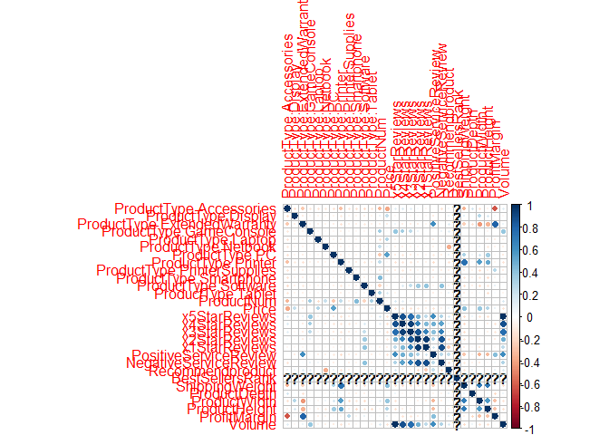<!-- -->

#### Based on excel correlation file, I am removing variables with correlation lower than .18 to target variable 'volume.' I also noticed '5StarReviews' has a perfect correlation of 1 to our target variable, 'Volume.' A perfect correlation to target variable risks feature bias and overfitting, thus I will remove from data frame.

```r
existing3 <- subset(existing2, select = -c(1:4, 8:9, 11:12, 15, 24:27))
str(existing3)
```

```
## 'data.frame':	80 obs. of  15 variables:
##  $ ProductType.Laptop    : num  0 0 0 1 1 0 0 0 0 0 ...
##  $ ProductType.Netbook   : num  0 0 0 0 0 0 0 0 0 0 ...
##  $ ProductType.PC        : num  1 1 1 0 0 0 0 0 0 0 ...
##  $ ProductType.Smartphone: num  0 0 0 0 0 0 0 0 0 0 ...
##  $ ProductNum            : num  101 102 103 104 105 106 107 108 109 110 ...
##  $ Price                 : num  949 2250 399 410 1080 ...
##  $ x4StarReviews         : num  3 1 0 19 31 30 3 19 9 1 ...
##  $ x3StarReviews         : num  2 0 0 8 11 10 0 12 2 1 ...
##  $ x2StarReviews         : num  0 0 0 3 7 9 0 5 0 0 ...
##  $ x1StarReviews         : num  0 0 0 9 36 40 1 9 2 0 ...
##  $ PositiveServiceReview : num  2 1 1 7 7 12 3 5 2 2 ...
##  $ NegativeServiceReview : num  0 0 0 8 20 5 0 3 1 0 ...
##  $ Recommendproduct      : num  0.9 0.9 0.9 0.8 0.7 0.3 0.9 0.7 0.8 0.9 ...
##  $ ShippingWeight        : num  25.8 50 17.4 5.7 7 1.6 7.3 12 1.8 0.75 ...
##  $ Volume                : num  12 8 12 196 232 332 44 132 64 40 ...
```

### EDA

#### Viewing correlation heatmap

```r
corrData3 <- cor(existing3)
corrplot(corrData3)
```

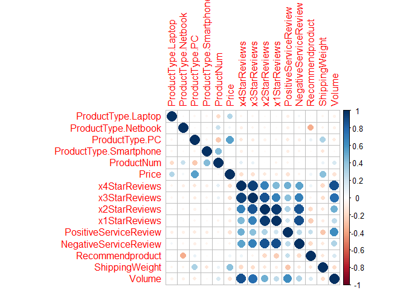<!-- -->

#### Enhancing the correlation heatmap. As you can see, x4Star, x3Star, x2Star, and PositiveService Review have highest correlation to target variable 'Volume.'

```r
color <- colorRampPalette(c('#BB4444','#EE9988','#FFFFFF','#77AADD','#4477AA'))
corrplot(corrData3, method = 'shade', shade.col = NA, tl.col = 'black', 
         type = 'upper', tl.srt = 45)
```

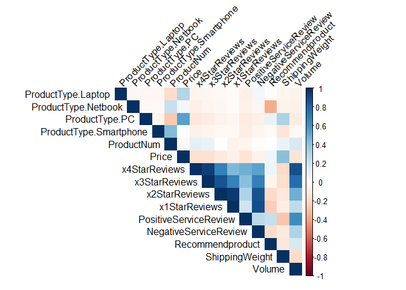<!-- -->

#### Histogram of Volume, reveals outliers

```r
ggplot(data = existing3, mapping = aes(x = Volume)) +
  geom_histogram()
```

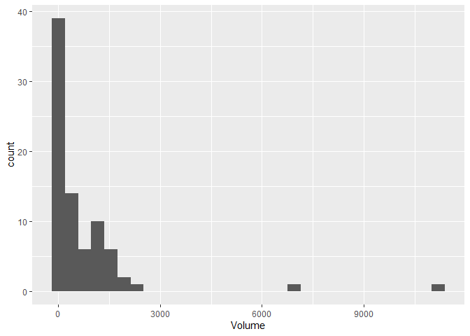<!-- -->

#### Plotting Sales Volume by Product Type. Our company is interested in sales volume for PCs, Laptops, Netbooks, and Smartphones at this time

```r
ggplot(data = existing, aes(x = ProductType, y = Volume, fill = ProductType)) +
  geom_bar(stat = 'identity') + 
  guides(fill=FALSE) +
  coord_flip()
```

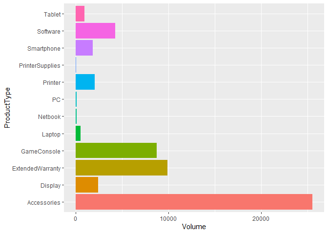<!-- -->

#### Plotting the impact '5StarReviews' have on Sales Volume. As you can see, it's a perfect correlation, which is impossible to sustain over time, thus why it was removed from modeling

```r
ggplot(data=existing, aes(x=x5StarReviews, y=Volume)) + 
  geom_point(aes(color=ProductType, size=2)) +
  theme_bw() +
  scale_x_continuous(trans = 'log2') + 
  scale_y_continuous(trans = 'log2') +
  geom_line() +
  facet_wrap(~ProductType) + 
  xlab('Number of 5 Star Reviews') +
  ylab('Sales Volume') +
  ggtitle('Effect of 5 Star Reviews on Sales Volume')
```

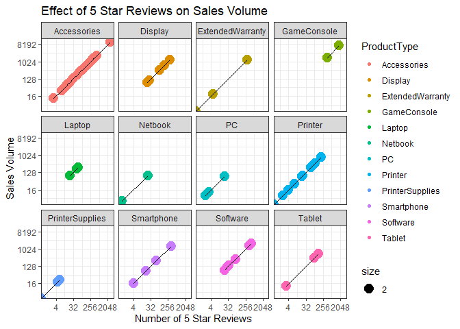<!-- -->

#### Now plotting the impact of 4 Star Reviews on Sales Volume, showing high positive correlation

```r
ggplot(data=existing, aes(x=x4StarReviews, y=Volume)) + 
  geom_point(aes(color=ProductType, size=2)) +
  theme_bw() +
  scale_x_continuous(trans = 'log2') + 
  scale_y_continuous(trans = 'log2') +
  geom_line() +
  facet_wrap(~ProductType) + 
  xlab('Number of 4 Star Reviews') +
  ylab('Sales Volume') +
  ggtitle('Effect of 4 Star Reviews on Sales Volume')
```

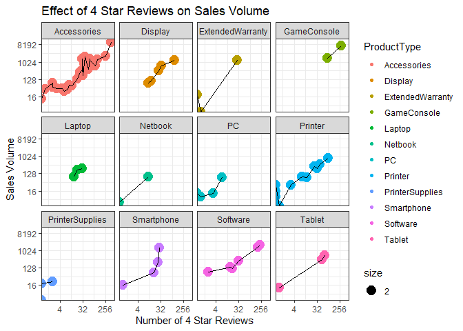<!-- -->

#### Now plotting impact of Positive Service Reviews on Sales Volume, also positive correlation

```r
ggplot(data=existing, aes(x=PositiveServiceReview, y=Volume)) + 
  geom_point(aes(color=ProductType, size=2)) +
  theme_bw() +
  scale_x_continuous(trans = 'log2') + 
  scale_y_continuous(trans = 'log2') +
  geom_line() +
  facet_wrap(~ProductType) + 
  xlab('Number of Positive Service Reviews') +
  ylab('Sales Volume') +
  ggtitle('Effect of Positive Service Reviews on Sales Volume')
```

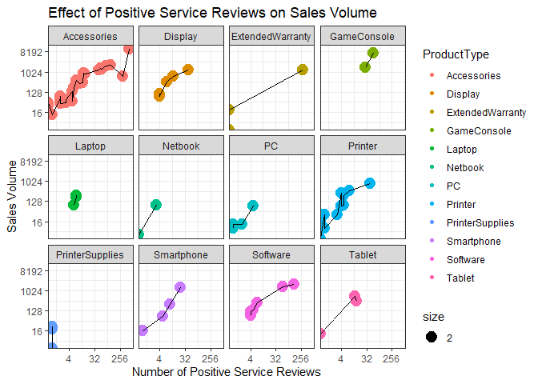<!-- -->

### Modeling 
#### Creating data partition and setting cross validation. Two observations eventually were removed since they were outliers and not products of interest.

```r
set.seed(123)

# CreateDataPartition() 75% and 25%
index1 <- createDataPartition(existing3$Volume, p=0.75, list = FALSE)
train1 <- existing3[ index1,]
test1 <- existing3[-index1,]

# Second iteration, removing 2 outlier rows #18 and #48 from test set, as they were both outliers and not products of interest of the retailer
test1_rem_out <- test1[!rownames(test1) %in% c('18', '48'), ]

# Checking structure of train1
str(train1)
```

```
## 'data.frame':	61 obs. of  15 variables:
##  $ ProductType.Laptop    : num  0 0 0 1 0 0 0 0 0 0 ...
##  $ ProductType.Netbook   : num  0 0 0 0 0 0 0 0 0 0 ...
##  $ ProductType.PC        : num  1 1 1 0 0 0 0 0 0 0 ...
##  $ ProductType.Smartphone: num  0 0 0 0 0 0 0 0 0 0 ...
##  $ ProductNum            : num  101 102 103 104 106 107 108 109 110 111 ...
##  $ Price                 : num  949 2250 399 410 114 ...
##  $ x4StarReviews         : num  3 1 0 19 30 3 19 9 1 2 ...
##  $ x3StarReviews         : num  2 0 0 8 10 0 12 2 1 2 ...
##  $ x2StarReviews         : num  0 0 0 3 9 0 5 0 0 4 ...
##  $ x1StarReviews         : num  0 0 0 9 40 1 9 2 0 15 ...
##  $ PositiveServiceReview : num  2 1 1 7 12 3 5 2 2 2 ...
##  $ NegativeServiceReview : num  0 0 0 8 5 0 3 1 0 1 ...
##  $ Recommendproduct      : num  0.9 0.9 0.9 0.8 0.3 0.9 0.7 0.8 0.9 0.5 ...
##  $ ShippingWeight        : num  25.8 50 17.4 5.7 1.6 7.3 12 1.8 0.75 1 ...
##  $ Volume                : num  12 8 12 196 332 44 132 64 40 84 ...
```

```r
# Setting cross validation
control1 <- trainControl(method = 'repeatedcv',
                         number = 10,
                         repeats = 1)
```

### Random forest model and tuning

```r
# set seed
set.seed(123)

# Creating dataframe for manual tuning
rfGrid <- expand.grid(mtry = c(2,3,4,5,6,7,8))

rf1 <- train(Volume ~ x4StarReviews + PositiveServiceReview + x2StarReviews + x3StarReviews + 
               x1StarReviews + NegativeServiceReview + Recommendproduct + ShippingWeight + Price,
             data = train1,
             method = 'rf',
             trControl = control1,
             tuneGrid = rfGrid)

rf1
```

```
## Random Forest 
## 
## 61 samples
##  9 predictor
## 
## No pre-processing
## Resampling: Cross-Validated (10 fold, repeated 1 times) 
## Summary of sample sizes: 55, 53, 55, 55, 55, 56, ... 
## Resampling results across tuning parameters:
## 
##   mtry  RMSE      Rsquared   MAE     
##   2     869.2921  0.8755901  416.0646
##   3     849.5229  0.8871013  400.1741
##   4     824.7775  0.8939530  386.7741
##   5     827.7373  0.8980015  384.5929
##   6     801.6069  0.9043345  372.1979
##   7     802.9288  0.9073910  372.2425
##   8     788.6419  0.9081729  365.2084
## 
## RMSE was used to select the optimal model using the smallest value.
## The final value used for the model was mtry = 8.
```

#### Level of importance for variables in model

```r
ggplot(varImp(rf1, scale=FALSE)) +
  geom_bar(stat = 'identity', fill = 'steelblue') +
  ggtitle('Variable Importance of Random Forest 1 on Sales Volume')
```

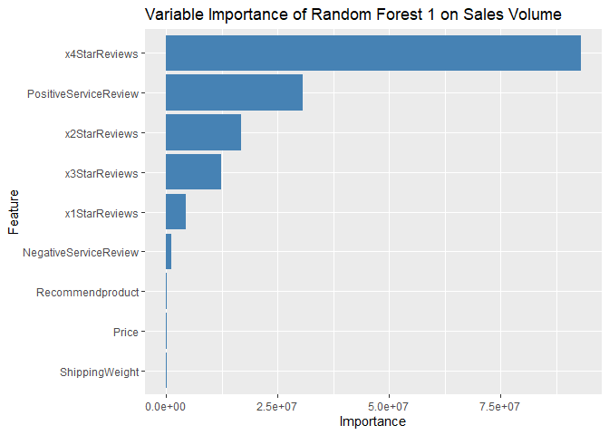<!-- -->

#### Predicting rf on test1. Note, a symmetrical pattern means a good residual plot!

```r
rf1Preds <- predict(rf1, newdata = test1_rem_out)
summary(rf1Preds)
```

```
##    Min. 1st Qu.  Median    Mean 3rd Qu.    Max. 
##   14.11   19.05  102.97  425.15  719.71 1271.74
```

```r
plot(rf1Preds)
```

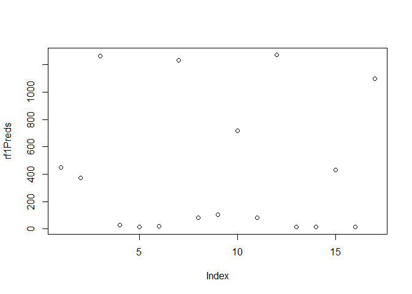<!-- -->

#### Running a postResample to test if it will do well on new data or if overfitting. Our Cross Validation R2 is .908 after tuning and feature selection, which is excellent. Our postResample R2 is even better, at .945. If cross validation was above 94-95%, it would be a red-flag for overfitting, but postResample in upper 90s means it will generalize well on new data (and is not overfitting).

```r
postResample(rf1Preds, test1_rem_out$Volume)
```

```
##        RMSE    Rsquared         MAE 
## 190.4253816   0.9452884  98.7387608
```

#### CV RMSE=788, R2=.908
#### PostResample RMSE=190, R2=.945


### Random Forest using feature selection

```r
set.seed(123)

rf2 <- train(Volume ~ x4StarReviews + PositiveServiceReview + x2StarReviews,
             data = train1,
             method = 'rf',
             trControl = control1)
```

```
## note: only 2 unique complexity parameters in default grid. Truncating the grid to 2 .
```

```r
rf2
```

```
## Random Forest 
## 
## 61 samples
##  3 predictor
## 
## No pre-processing
## Resampling: Cross-Validated (10 fold, repeated 1 times) 
## Summary of sample sizes: 55, 53, 55, 55, 55, 56, ... 
## Resampling results across tuning parameters:
## 
##   mtry  RMSE      Rsquared   MAE     
##   2     771.2710  0.9218973  349.2301
##   3     745.3771  0.9284383  338.8776
## 
## RMSE was used to select the optimal model using the smallest value.
## The final value used for the model was mtry = 3.
```

#### Variable importance

```r
ggplot(varImp(rf2, scale=FALSE)) +
  geom_bar(stat = 'identity', fill = 'steelblue') +
  ggtitle('Variable Importance of Random Forest 2 on Sales Volume')
```

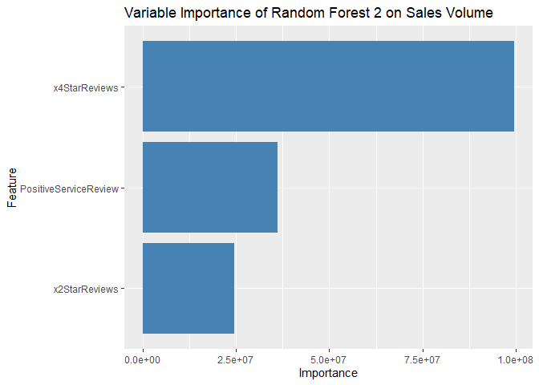<!-- -->

#### Plotting the residuals against the actual values for Volume. The graph below shows a couple volume outliers, and further research reveals both outliers are for accessory product, which are not products of interest.

```r
resid_rf2 <- residuals(rf2)
plot(train1$Volume, resid_rf2, 
     xlab = 'Sales Volume', 
     ylab = 'Residuals', 
     main ='Predicted Sales Volume Residuals Plot',
     abline(0,0))
```

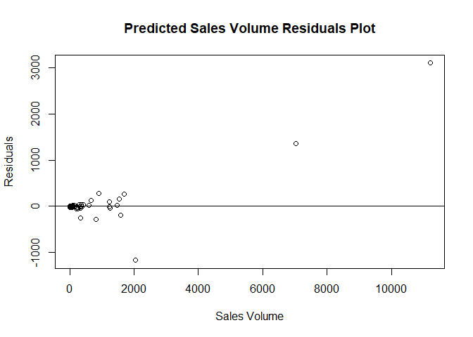<!-- -->

#### Predicting rf2 on test1. This is another excellent residual plot, showing our predictions are consistent with regression.

```r
rf2Preds <- predict(rf2, newdata = test1_rem_out)
summary(rf2Preds)
```

```
##     Min.  1st Qu.   Median     Mean  3rd Qu.     Max. 
##    2.742   14.336  103.066  419.753  714.428 1379.420
```

```r
plot(rf2Preds)
```

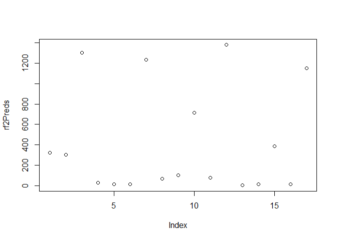<!-- -->

#### postResample to test if it will do well on new data or if overfitting. It is even better than previous model (note: this is because we removed 2 outlier volumes from testSet, as indicated in DataPartition section above).

```r
postResample(rf2Preds, test1_rem_out$Volume)
```

```
##        RMSE    Rsquared         MAE 
## 153.8183544   0.9718405  74.7555212
```

#### CV RMSE = 745, R2=.928
#### PostResample RMSE=153, R2=.972
## The postResample R2 and RMSE for a regression model is excellent. This is our top model! Many iterations and algorithms were tried...as you can see in remaining document, but this model ended was the best.


### Random Forest using feature selection

```r
set.seed(123)

rf3 <- train(Volume ~ x4StarReviews + PositiveServiceReview + x3StarReviews,
             data = train1,
             method = 'rf',
             trControl = control1)
```

```
## note: only 2 unique complexity parameters in default grid. Truncating the grid to 2 .
```

```r
rf3
```

```
## Random Forest 
## 
## 61 samples
##  3 predictor
## 
## No pre-processing
## Resampling: Cross-Validated (10 fold, repeated 1 times) 
## Summary of sample sizes: 55, 53, 55, 55, 55, 56, ... 
## Resampling results across tuning parameters:
## 
##   mtry  RMSE      Rsquared   MAE     
##   2     710.5834  0.9285459  323.8009
##   3     684.5642  0.9346194  313.5800
## 
## RMSE was used to select the optimal model using the smallest value.
## The final value used for the model was mtry = 3.
```

#### Variable importance

```r
ggplot(varImp(rf3, scale=FALSE)) +
  geom_bar(stat = 'identity', fill = 'steelblue') +
  ggtitle('Variable Importance of Random Forest 3 on Sales Volume')
```

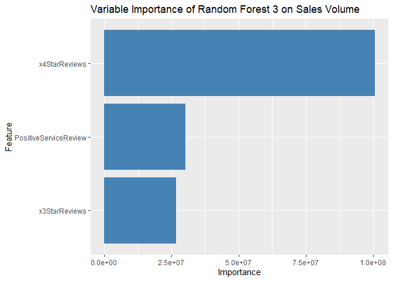<!-- -->

#### Predicting rf3 on test1

```r
rf3Preds <- predict(rf3, newdata = test1_rem_out)
summary(rf3Preds)
```

```
##     Min.  1st Qu.   Median     Mean  3rd Qu.     Max. 
##    5.789   11.959   94.221  425.461  737.133 1358.924
```

#### postResample to test if it will do well on new data or if overfitting. Another excellent model.

```r
postResample(rf3Preds, test1_rem_out$Volume)
```

```
##        RMSE    Rsquared         MAE 
## 167.7971733   0.9549701  83.4029171
```

#### CV RMSe=648, R2=.934
#### PostResample RMSE=167, R2=.954


### Random Forest using feature selection

```r
set.seed(123)
rf4 <- train(Volume ~ x4StarReviews + PositiveServiceReview + x3StarReviews + x2StarReviews + 
               x1StarReviews + NegativeServiceReview,
             data = train1,
             method = 'rf',
             trControl = control1)

rf4
```

```
## Random Forest 
## 
## 61 samples
##  6 predictor
## 
## No pre-processing
## Resampling: Cross-Validated (10 fold, repeated 1 times) 
## Summary of sample sizes: 55, 53, 55, 55, 55, 56, ... 
## Resampling results across tuning parameters:
## 
##   mtry  RMSE      Rsquared   MAE     
##   2     844.5227  0.8864850  396.6254
##   4     801.2553  0.9052961  370.6409
##   6     790.8997  0.9072861  362.8766
## 
## RMSE was used to select the optimal model using the smallest value.
## The final value used for the model was mtry = 6.
```

#### Variable importance using ggplot

```r
ggplot(varImp(rf4, scale=FALSE)) +
  geom_bar(stat = 'identity', fill = 'steelblue') +
  ggtitle('Variable Importance of Random Forest 4 on Sales Volume')
```

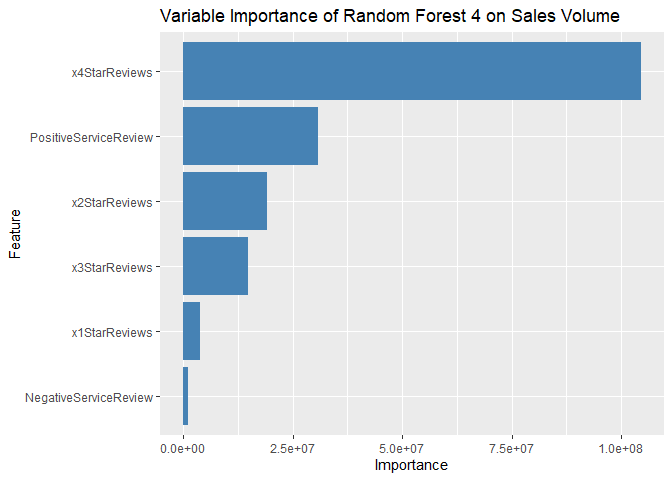<!-- -->

#### Plotting the residuals against the actual values for Volume. Again, graph shows outlier.

```r
resid_rf4 <- residuals(rf4)
plot(train1$Volume, resid_rf4, xlab = 'Sales Volume', ylab = 'Residuals', 
     main='Predicted Sales Volume Residuals Plot',
     abline(0,0))
```

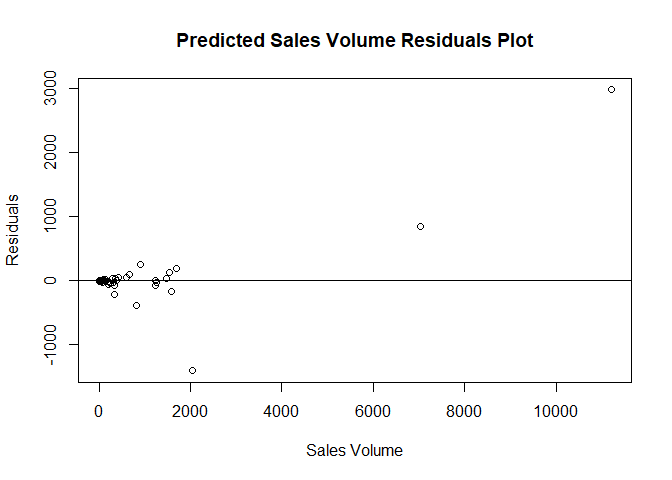<!-- -->

#### Predicting rf4 on test1

```r
rf4Preds <- predict(rf4, newdata = test1_rem_out)
summary(rf4Preds)
```

```
##     Min.  1st Qu.   Median     Mean  3rd Qu.     Max. 
##    7.937   15.732   98.618  426.150  782.476 1304.662
```

#### postResample to test if it will do well on new data or if overfitting

```r
postResample(rf4Preds, test1_rem_out$Volume)
```

```
##       RMSE   Rsquared        MAE 
## 177.453911   0.952956  87.506546
```

#### CV RMSE=783, R2=.909
#### RMSE=177, R2=.952


### Support Vector Machines -- RBF Kernel

```r
set.seed(123)

# Creating dataframe for manual tuning
rbfGrid <- expand.grid(sigma = c(.01, .015, .2),
                       C = c(10, 100, 1000))

rbf1 <- train(Volume ~ x4StarReviews + x3StarReviews + PositiveServiceReview,
              data = train1,
              method = 'svmRadial',
              trControl = control1,
              tuneGrid = rbfGrid,
              preProc = c('center','scale'))

rbf1
```

```
## Support Vector Machines with Radial Basis Function Kernel 
## 
## 61 samples
##  3 predictor
## 
## Pre-processing: centered (3), scaled (3) 
## Resampling: Cross-Validated (10 fold, repeated 1 times) 
## Summary of sample sizes: 55, 53, 55, 55, 55, 56, ... 
## Resampling results across tuning parameters:
## 
##   sigma  C     RMSE       Rsquared   MAE     
##   0.010    10   944.2228  0.8594778  489.1231
##   0.010   100   930.7863  0.8149199  473.1634
##   0.010  1000  1190.2695  0.8309208  580.6230
##   0.015    10   986.8673  0.8419784  507.9508
##   0.015   100   940.5278  0.8123009  480.0726
##   0.015  1000  1236.2804  0.8613697  590.2852
##   0.200    10   913.7802  0.9182651  467.5324
##   0.200   100   879.2184  0.9194906  436.6931
##   0.200  1000   949.7834  0.9093674  462.1128
## 
## RMSE was used to select the optimal model using the smallest value.
## The final values used for the model were sigma = 0.2 and C = 100.
```

#### Predicting rbf on test1

```r
rbf1Preds <- predict(rbf1, newdata = test1_rem_out)
summary(rbf1Preds)
```

```
##    Min. 1st Qu.  Median    Mean 3rd Qu.    Max. 
##   29.81   94.91  267.83  463.59  552.12 2146.20
```

#### postResample to test if it will do well on new data or if overfitting

```r
postResample(rbf1Preds, test1_rem_out$Volume)
```

```
##        RMSE    Rsquared         MAE 
## 264.0730623   0.8148197 177.1172248
```

#### CV RMSE=879, R2=.919
#### PostResample RMSE=264, R2=.815


### Support Vector Machines -- RBF Kernel feature selection

```r
set.seed(123)

# Creating dataframe for manual tuning
rbfGrid <- expand.grid(sigma = c(.01, .015, .2),
                       C = c(10, 100, 1000))

rbf2 <- train(Volume ~ x4StarReviews + PositiveServiceReview + x2StarReviews,
              data = train1,
              method = 'svmRadial',
              trControl = control1,
              tuneGrid = rbfGrid,
              preProc = c('center','scale'))

rbf2
```

```
## Support Vector Machines with Radial Basis Function Kernel 
## 
## 61 samples
##  3 predictor
## 
## Pre-processing: centered (3), scaled (3) 
## Resampling: Cross-Validated (10 fold, repeated 1 times) 
## Summary of sample sizes: 55, 53, 55, 55, 55, 56, ... 
## Resampling results across tuning parameters:
## 
##   sigma  C     RMSE      Rsquared   MAE     
##   0.010    10  935.7611  0.8655808  465.7621
##   0.010   100  774.4498  0.8457538  408.1163
##   0.010  1000  729.0330  0.8563199  400.4417
##   0.015    10  879.8614  0.8620022  452.0967
##   0.015   100  761.7506  0.8470788  417.3052
##   0.015  1000  791.0228  0.8280795  418.6904
##   0.200    10  838.7191  0.9322844  436.6363
##   0.200   100  783.3714  0.9512888  398.3164
##   0.200  1000  657.2931  0.9099973  356.3912
## 
## RMSE was used to select the optimal model using the smallest value.
## The final values used for the model were sigma = 0.2 and C = 1000.
```

#### Predicting rbf2 on test1

```r
rbf2Preds <- predict(rbf2, newdata = test1_rem_out)
summary(rbf2Preds)
```

```
##    Min. 1st Qu.  Median    Mean 3rd Qu.    Max. 
##  -253.3    71.6   256.6   512.9   343.3  2499.2
```


```r
# postResample to test if it will do well on new data or if overfitting
postResample(rbf2Preds, test1_rem_out$Volume)
```

```
##        RMSE    Rsquared         MAE 
## 420.0433306   0.7040338 243.6208248
```

#### CV RMSE=657, R2=.909
#### PostResample RMSE=420, R2=.704 
#### Negative predictions, move on


### Support Vector Machines -- Linear

```r
set.seed(123)

### Creating dataframe for manual tuning
linearGrid <- expand.grid(C = c(1, 10, 100, 1000))

linear1 <- train(Volume ~ x4StarReviews + x3StarReviews + PositiveServiceReview,
                 data = train1,
                 method = 'svmLinear',
                 trControl = control1,
                 tuneGrid = linearGrid,
                 preProc = c('center','scale'))

linear1
```

```
## Support Vector Machines with Linear Kernel 
## 
## 61 samples
##  3 predictor
## 
## Pre-processing: centered (3), scaled (3) 
## Resampling: Cross-Validated (10 fold, repeated 1 times) 
## Summary of sample sizes: 55, 53, 55, 55, 55, 56, ... 
## Resampling results across tuning parameters:
## 
##   C     RMSE      Rsquared   MAE     
##      1  873.4355  0.8664637  456.9757
##     10  843.0240  0.8585048  447.9310
##    100  848.6679  0.8571624  453.5503
##   1000  847.9066  0.8571915  452.4325
## 
## RMSE was used to select the optimal model using the smallest value.
## The final value used for the model was C = 10.
```

#### Predicting rbf on test1

```r
linearPreds <- predict(linear1, newdata = test1_rem_out)
summary(linearPreds)
```

```
##    Min. 1st Qu.  Median    Mean 3rd Qu.    Max. 
##  -196.9  -129.0   124.7   388.2   561.6  2364.1
```

#### postResample to test if it will do well on new data or if overfitting

```r
lin_PR <- postResample(linearPreds, test1_rem_out$Volume)
```

#### CV RMSE=843, R2=.858
#### PR RMSE=462, R2=.583
#### Negative predictions, move on


### SVM -- Linear, changing features

```r
set.seed(123)

# Creating dataframe for manual tuning
linearGrid <- expand.grid(C = c(1, 10, 100, 1000))

linear2 <- train(Volume ~ x4StarReviews + x3StarReviews + PositiveServiceReview + 
                   NegativeServiceReview + Price,
                 data = train1,
                 method = 'svmLinear',
                 trControl = control1,
                 tuneGrid = linearGrid,
                 preProc = c('center','scale'))

linear2
```

```
## Support Vector Machines with Linear Kernel 
## 
## 61 samples
##  5 predictor
## 
## Pre-processing: centered (5), scaled (5) 
## Resampling: Cross-Validated (10 fold, repeated 1 times) 
## Summary of sample sizes: 55, 53, 55, 55, 55, 56, ... 
## Resampling results across tuning parameters:
## 
##   C     RMSE      Rsquared   MAE     
##      1  553.1088  0.8300446  328.9984
##     10  538.0562  0.8151764  327.8059
##    100  538.1027  0.8148848  327.7453
##   1000  538.5593  0.8146058  327.9203
## 
## RMSE was used to select the optimal model using the smallest value.
## The final value used for the model was C = 10.
```


```r
# Predicting rbf on test1
linear2Preds <- predict(linear2, newdata = test1_rem_out)
summary(linear2Preds)
```

```
##      Min.   1st Qu.    Median      Mean   3rd Qu.      Max. 
## -155.3142 -102.7355    0.5217  435.3928  496.4102 2631.1579
```

#### postResample to test if it will do well on new data or if overfitting

```r
postResample(linear2Preds, test1_rem_out$Volume)
```

```
##        RMSE    Rsquared         MAE 
## 501.1605728   0.5858754 334.9077977
```

#### RMSE=1120, R2=56.9
#### Negative predictions, move on


### Support Vector Machines -- Polynomial

```r
set.seed(123)

# Creating dataframe for manual tuning
polyGrid <- expand.grid(degree = c(2,3,4),
                        scale = c(1,2),
                        C = c(.1, 1, 10, 100))

poly1 <- train(Volume ~ x4StarReviews + x3StarReviews + PositiveServiceReview,
               data = train1,
               method = 'svmPoly',
               trControl = control1,
               tuneGrid = polyGrid,
               preProc = c('center','scale'))

poly1
```

```
## Support Vector Machines with Polynomial Kernel 
## 
## 61 samples
##  3 predictor
## 
## Pre-processing: centered (3), scaled (3) 
## Resampling: Cross-Validated (10 fold, repeated 1 times) 
## Summary of sample sizes: 55, 53, 55, 55, 55, 56, ... 
## Resampling results across tuning parameters:
## 
##   degree  scale  C      RMSE        Rsquared   MAE       
##   2       1        0.1    1155.408  0.7966076    571.6401
##   2       1        1.0    4104.003  0.8301827   1770.0867
##   2       1       10.0    6987.814  0.8557033   2939.2082
##   2       1      100.0    9796.456  0.8389599   4083.3127
##   2       2        0.1    2104.421  0.8267500    966.7124
##   2       2        1.0    6491.915  0.8763071   2740.5152
##   2       2       10.0    9245.414  0.8522459   3859.6825
##   2       2      100.0   10042.438  0.8331194   4185.3819
##   3       1        0.1    1118.828  0.8898300    534.3918
##   3       1        1.0    3755.882  0.9381422   1597.5451
##   3       1       10.0    7095.492  0.9176351   2965.7635
##   3       1      100.0   39627.409  0.9024923  16252.9238
##   3       2        0.1    2667.568  0.8509251   1166.7636
##   3       2        1.0    4472.345  0.8879559   1896.1439
##   3       2       10.0   31802.988  0.9179907  13053.9787
##   3       2      100.0   86413.899  0.8848359  35365.6943
##   4       1        0.1    6877.359  0.8003001   2881.4997
##   4       1        1.0   54000.769  0.8216935  22115.1070
##   4       1       10.0  197327.453  0.9111491  80637.6759
##   4       1      100.0   25145.120  0.9146607  10346.8229
##   4       2        0.1   31923.943  0.8869538  13115.3285
##   4       2        1.0  167176.011  0.8980690  68329.9630
##   4       2       10.0   68279.157  0.9005098  27957.4632
##   4       2      100.0  157877.892  0.9005079  64537.4960
## 
## RMSE was used to select the optimal model using the smallest value.
## The final values used for the model were degree = 3, scale = 1 and C = 0.1.
```

#### Predicting rbf on test1

```r
polyPreds <- predict(poly1, newdata = test1_rem_out)
summary(polyPreds)
```

```
##    Min. 1st Qu.  Median    Mean 3rd Qu.    Max. 
##  -31.78  -20.75  218.56  370.45  536.88 1240.00
```

#### postResample to test if it will do well on new data or if overfitting

```r
postResample(polyPreds, test1_rem_out$Volume)
```

```
##        RMSE    Rsquared         MAE 
## 334.4330248   0.7687032 174.1454650
```

#### RMSE=688, R2=60.2
#### Negative predictions, move on


### SVM -- Polynomial

```r
set.seed(123)

# Creating dataframe for manual tuning
polyGrid <- expand.grid(degree = c(2,3,4),
                        scale = c(1,2),
                        C = c(.1, 1, 10, 100))

poly2 <- train(Volume ~ x4StarReviews + x2StarReviews + PositiveServiceReview + 
                 NegativeServiceReview,
               data = train1,
               method = 'svmPoly',
               trControl = control1,
               tuneGrid = polyGrid,
               preProc = c('center','scale'))

poly2
```

```
## Support Vector Machines with Polynomial Kernel 
## 
## 61 samples
##  4 predictor
## 
## Pre-processing: centered (4), scaled (4) 
## Resampling: Cross-Validated (10 fold, repeated 1 times) 
## Summary of sample sizes: 55, 53, 55, 55, 55, 56, ... 
## Resampling results across tuning parameters:
## 
##   degree  scale  C      RMSE         Rsquared   MAE        
##   2       1        0.1     876.0226  0.8081674     469.4007
##   2       1        1.0    1532.8601  0.8154286     722.1496
##   2       1       10.0   14512.8090  0.8528996    6032.6490
##   2       1      100.0   11848.1045  0.9129566    4942.3458
##   2       2        0.1    1115.2333  0.8751110     559.6023
##   2       2        1.0    5251.8265  0.8636670    2247.9786
##   2       2       10.0   11368.9766  0.8529120    4751.2822
##   2       2      100.0   11354.9053  0.9063491    4732.0598
##   3       1        0.1   18313.5053  0.8935899    7558.3279
##   3       1        1.0   24882.0057  0.8523866   10250.6328
##   3       1       10.0   61551.6914  0.9182948   25214.9606
##   3       1      100.0   36782.7066  0.8210000   15136.3743
##   3       2        0.1   37470.6589  0.8460612   15381.2988
##   3       2        1.0   34037.7172  0.8417435   13992.1891
##   3       2       10.0   62873.4712  0.8259141   25775.7687
##   3       2      100.0  100280.0776  0.8102818   41118.1724
##   4       1        0.1   96870.0477  0.8372587   39632.3275
##   4       1        1.0    9912.6724  0.8582925    4146.7389
##   4       1       10.0  174996.0882  0.8816298   71529.9157
##   4       1      100.0  334667.4580  0.7981803  136752.8839
##   4       2        0.1  233541.8543  0.8434558   95446.7978
##   4       2        1.0  404176.1594  0.8485852  165110.5747
##   4       2       10.0  704939.6023  0.8342341  287898.1043
##   4       2      100.0  790317.3179  0.8342340  322758.2980
## 
## RMSE was used to select the optimal model using the smallest value.
## The final values used for the model were degree = 2, scale = 1 and C = 0.1.
```

#### Predicting rbf on test1

```r
poly2Preds <- predict(poly2, newdata = test1_rem_out)
summary(poly2Preds)
```

```
##    Min. 1st Qu.  Median    Mean 3rd Qu.    Max. 
##   132.6   154.0   256.1   469.9   472.7  1710.2
```

#### postResample to test if it will do well on new data or if overfitting

```r
postResample(poly2Preds, test1_rem_out$Volume)
```

```
##        RMSE    Rsquared         MAE 
## 402.3116913   0.5699793 256.8209379
```

#### RMSE=402, R2=0.57


### Gradient Boosting using feature selection

```r
set.seed(123)

gbm1 <- train(Volume ~ x4StarReviews + x2StarReviews + PositiveServiceReview,
              data = train1,
              method = 'gbm',
              trControl = control1,
              preProc = c('center','scale'))
```


```r
gbm1
```

```
## Stochastic Gradient Boosting 
## 
## 61 samples
##  3 predictor
## 
## Pre-processing: centered (3), scaled (3) 
## Resampling: Cross-Validated (10 fold, repeated 1 times) 
## Summary of sample sizes: 55, 53, 55, 55, 55, 56, ... 
## Resampling results across tuning parameters:
## 
##   interaction.depth  n.trees  RMSE      Rsquared   MAE     
##   1                   50      1010.966  0.8249911  571.2535
##   1                  100      1054.100  0.8371555  585.4725
##   1                  150      1024.901  0.8667286  552.3807
##   2                   50      1010.350  0.8575585  557.7797
##   2                  100      1046.985  0.8593534  568.5074
##   2                  150      1053.486  0.8588568  578.0264
##   3                   50      1010.362  0.8472539  564.3698
##   3                  100      1038.869  0.8615773  564.2031
##   3                  150      1055.289  0.8588360  567.2579
## 
## Tuning parameter 'shrinkage' was held constant at a value of 0.1
## 
## Tuning parameter 'n.minobsinnode' was held constant at a value of 10
## RMSE was used to select the optimal model using the smallest value.
## The final values used for the model were n.trees = 50, interaction.depth =
##  2, shrinkage = 0.1 and n.minobsinnode = 10.
```

#### Predicting gbm on test1

```r
gbmPreds <- predict(gbm1, newdata = test1_rem_out)
summary(gbmPreds)
```

```
##     Min.  1st Qu.   Median     Mean  3rd Qu.     Max. 
##    9.966   35.707   40.684  587.565 1340.268 2091.828
```

#### postResample to test if it will do well on new data or if overfitting

```r
postResample(gbmPreds, test1_rem_out$Volume)
```

```
##        RMSE    Rsquared         MAE 
## 266.4904990   0.9105057 172.6952417
```

#### CV RMSE=1010, R2=.858
#### PostResample RMSE=266, R2=.911 


### Gradient Boosting feature selection

```r
set.seed(123)

gbm2 <- train(Volume ~ x4StarReviews + x3StarReviews + PositiveServiceReview,
              data = train1,
              method = 'gbm',
              trControl = control1,
              preProc = c('center','scale'))
```

```r
gbm2
```

```
## Stochastic Gradient Boosting 
## 
## 61 samples
##  3 predictor
## 
## Pre-processing: centered (3), scaled (3) 
## Resampling: Cross-Validated (10 fold, repeated 1 times) 
## Summary of sample sizes: 55, 53, 55, 55, 55, 56, ... 
## Resampling results across tuning parameters:
## 
##   interaction.depth  n.trees  RMSE      Rsquared   MAE     
##   1                   50      1016.102  0.8326938  568.3590
##   1                  100      1063.431  0.8452965  576.8135
##   1                  150      1039.162  0.8622175  553.1044
##   2                   50      1021.436  0.8660802  555.2569
##   2                  100      1041.471  0.8672959  564.3505
##   2                  150      1053.235  0.8573396  580.2639
##   3                   50      1009.603  0.8574569  552.9631
##   3                  100      1056.474  0.8524858  573.3080
##   3                  150      1066.260  0.8481968  572.4470
## 
## Tuning parameter 'shrinkage' was held constant at a value of 0.1
## 
## Tuning parameter 'n.minobsinnode' was held constant at a value of 10
## RMSE was used to select the optimal model using the smallest value.
## The final values used for the model were n.trees = 50, interaction.depth =
##  3, shrinkage = 0.1 and n.minobsinnode = 10.
```

#### Predicting gbm2 on test1

```r
gbm2Preds <- predict(gbm2, newdata = test1_rem_out)
summary(gbm2Preds)
```

```
##    Min. 1st Qu.  Median    Mean 3rd Qu.    Max. 
##  -13.48   48.78   48.78  541.48 1105.80 2141.98
```

#### postResample to test if it will do well on new data or if overfitting

```r
postResample(gbm2Preds, test1_rem_out$Volume)
```

```
##        RMSE    Rsquared         MAE 
## 264.0765350   0.8822213 156.1233574
```

#### CV RMSE=813, R2=.962 
#### PostResample RMSE=415, R2=.706 


### Bayesian Ridge Regression, L1

```r
set.seed(123)

bay1 <- train(Volume ~ x4StarReviews + PositiveServiceReview + x2StarReviews,
              data = train1,
              method = 'blassoAveraged',
              trControl = control1,
              preProc = c('center','scale'))

bay1
```

#### Predicting bay1 on test1

```r
bay1Preds <- predict(bay1, newdata = test1_rem_out)
summary(bay1Preds)
```

```
##    Min. 1st Qu.  Median    Mean 3rd Qu.    Max. 
## -211.99 -187.44   79.51  397.59  667.00 2491.79
```

#### postResample to test if it will do well on new data or if overfitting

```r
postResample(bay1Preds, test1$Volume)
```

```
##     RMSE Rsquared      MAE 
## 925.6151       NA 716.4564
```

#### Negative predictions regardless of feature selection, high RMSE, doesn't work with this task
#### CV RMSE=1148, R2=.753

#### After deleting problem outlier rows in test set - 17 observations

```r
Actual_vs_Predicted_NoOutlier <- data.frame(test1_rem_out %>% select(ProductNum, Volume), 
                                            rf1Preds, rf2Preds, rf3Preds, rf4Preds, rbf1Preds,
                                            rbf2Preds, linearPreds, linear2Preds, polyPreds,
                                            poly2Preds, gbmPreds, gbm2Preds)

#### Exporting to excel
write.xlsx(Actual_vs_Predicted_NoOutlier, file = "Actual_vs_Predicted_NoOutlier.xlsx", row.names=TRUE)
```

## Using Top Model rf2 algorithm to make predictions on new product data
#### New data frame must be prepared the same way as training data set
#### Target variable: 'Volume' for PC, Laptops, Netbooks, and Smartphones product types

#### Importing data

```r
new <- read.csv(file.path('C:/Users/jlbro/OneDrive/C3T3', 'new.csv'), stringsAsFactors = TRUE)
```

#### Checking structure

```r
str(new)
```

```
## 'data.frame':	24 obs. of  18 variables:
##  $ ProductType          : Factor w/ 12 levels "Accessories",..: 7 7 5 5 5 6 6 6 6 12 ...
##  $ ProductNum           : int  171 172 173 175 176 178 180 181 183 186 ...
##  $ Price                : num  699 860 1199 1199 1999 ...
##  $ x5StarReviews        : int  96 51 74 7 1 19 312 23 3 296 ...
##  $ x4StarReviews        : int  26 11 10 2 1 8 112 18 4 66 ...
##  $ x3StarReviews        : int  14 10 3 1 1 4 28 7 0 30 ...
##  $ x2StarReviews        : int  14 10 3 1 3 1 31 22 1 21 ...
##  $ x1StarReviews        : int  25 21 11 1 0 10 47 18 0 36 ...
##  $ PositiveServiceReview: int  12 7 11 2 0 2 28 5 1 28 ...
##  $ NegativeServiceReview: int  3 5 5 1 1 4 16 16 0 9 ...
##  $ Recommendproduct     : num  0.7 0.6 0.8 0.6 0.3 0.6 0.7 0.4 0.7 0.8 ...
##  $ BestSellersRank      : int  2498 490 111 4446 2820 4140 2699 1704 5128 34 ...
##  $ ShippingWeight       : num  19.9 27 6.6 13 11.6 5.8 4.6 4.8 4.3 3 ...
##  $ ProductDepth         : num  20.63 21.89 8.94 16.3 16.81 ...
##  $ ProductWidth         : num  19.2 27 12.8 10.8 10.9 ...
##  $ ProductHeight        : num  8.39 9.13 0.68 1.4 0.88 1.2 0.95 1.5 0.97 0.37 ...
##  $ ProfitMargin         : num  0.25 0.2 0.1 0.15 0.23 0.08 0.09 0.11 0.09 0.1 ...
##  $ Volume               : int  0 0 0 0 0 0 0 0 0 0 ...
```

#### Making new dataframe same column wise as trained dataframes

```r
newDummy <- dummyVars(' ~ .', data = new)
```


```r
new2 <- data.frame(predict(newDummy, newdata = new))
```

#### Checking structure again

```r
str(new2)
```

```
## 'data.frame':	24 obs. of  29 variables:
##  $ ProductType.Accessories     : num  0 0 0 0 0 0 0 0 0 0 ...
##  $ ProductType.Display         : num  0 0 0 0 0 0 0 0 0 0 ...
##  $ ProductType.ExtendedWarranty: num  0 0 0 0 0 0 0 0 0 0 ...
##  $ ProductType.GameConsole     : num  0 0 0 0 0 0 0 0 0 0 ...
##  $ ProductType.Laptop          : num  0 0 1 1 1 0 0 0 0 0 ...
##  $ ProductType.Netbook         : num  0 0 0 0 0 1 1 1 1 0 ...
##  $ ProductType.PC              : num  1 1 0 0 0 0 0 0 0 0 ...
##  $ ProductType.Printer         : num  0 0 0 0 0 0 0 0 0 0 ...
##  $ ProductType.PrinterSupplies : num  0 0 0 0 0 0 0 0 0 0 ...
##  $ ProductType.Smartphone      : num  0 0 0 0 0 0 0 0 0 0 ...
##  $ ProductType.Software        : num  0 0 0 0 0 0 0 0 0 0 ...
##  $ ProductType.Tablet          : num  0 0 0 0 0 0 0 0 0 1 ...
##  $ ProductNum                  : num  171 172 173 175 176 178 180 181 183 186 ...
##  $ Price                       : num  699 860 1199 1199 1999 ...
##  $ x5StarReviews               : num  96 51 74 7 1 19 312 23 3 296 ...
##  $ x4StarReviews               : num  26 11 10 2 1 8 112 18 4 66 ...
##  $ x3StarReviews               : num  14 10 3 1 1 4 28 7 0 30 ...
##  $ x2StarReviews               : num  14 10 3 1 3 1 31 22 1 21 ...
##  $ x1StarReviews               : num  25 21 11 1 0 10 47 18 0 36 ...
##  $ PositiveServiceReview       : num  12 7 11 2 0 2 28 5 1 28 ...
##  $ NegativeServiceReview       : num  3 5 5 1 1 4 16 16 0 9 ...
##  $ Recommendproduct            : num  0.7 0.6 0.8 0.6 0.3 0.6 0.7 0.4 0.7 0.8 ...
##  $ BestSellersRank             : num  2498 490 111 4446 2820 ...
##  $ ShippingWeight              : num  19.9 27 6.6 13 11.6 5.8 4.6 4.8 4.3 3 ...
##  $ ProductDepth                : num  20.63 21.89 8.94 16.3 16.81 ...
##  $ ProductWidth                : num  19.2 27 12.8 10.8 10.9 ...
##  $ ProductHeight               : num  8.39 9.13 0.68 1.4 0.88 1.2 0.95 1.5 0.97 0.37 ...
##  $ ProfitMargin                : num  0.25 0.2 0.1 0.15 0.23 0.08 0.09 0.11 0.09 0.1 ...
##  $ Volume                      : num  0 0 0 0 0 0 0 0 0 0 ...
```

```r
new2$BestSellersRank <- NULL

str(new2)
```

```r
new3 <- subset(new2, select = -c(1:4, 8:9, 11:12, 15, 24:27))

str(new3)
```

#### Predicting rf2 on 'new3' product data set

```r
set.seed(123)

Predicted_Volume <- predict(rf2, newdata = new3)
```

#### Adding our predictions to the 'new' product dataframe

```r
Preds_rf2_df <- data.frame(new3 %>% select(ProductType.Laptop, ProductType.Netbook, ProductType.PC, ProductType.Smartphone, ProductNum, Volume), Predicted_Volume) 

TopModelPreds <- read.xlsx(file.path('C:/Users/jlbro/OneDrive/C3T3-3', 'newPreds_TopModel_rf2.xlsx'))
```


## Sales predictions ('Predicted_Volume') on the new data set provided by the client.

```r
kable(TopModelPreds) %>% 
  kable_styling(bootstrap_options = c('striped','hover'))
```

<table class="table table-striped table-hover" style="margin-left: auto; margin-right: auto;">
 <thead>
  <tr>
   <th style="text-align:left;"> Product.Type </th>
   <th style="text-align:right;"> ProductNum </th>
   <th style="text-align:right;"> 4.Star.Reviews </th>
   <th style="text-align:right;"> Predicted_Volume </th>
  </tr>
 </thead>
<tbody>
  <tr>
   <td style="text-align:left;"> PC </td>
   <td style="text-align:right;"> 171 </td>
   <td style="text-align:right;"> 26 </td>
   <td style="text-align:right;"> 478.64227 </td>
  </tr>
  <tr>
   <td style="text-align:left;"> PC </td>
   <td style="text-align:right;"> 172 </td>
   <td style="text-align:right;"> 11 </td>
   <td style="text-align:right;"> 157.28747 </td>
  </tr>
  <tr>
   <td style="text-align:left;"> Laptop </td>
   <td style="text-align:right;"> 173 </td>
   <td style="text-align:right;"> 10 </td>
   <td style="text-align:right;"> 187.16573 </td>
  </tr>
  <tr>
   <td style="text-align:left;"> Laptop </td>
   <td style="text-align:right;"> 175 </td>
   <td style="text-align:right;"> 2 </td>
   <td style="text-align:right;"> 36.68747 </td>
  </tr>
  <tr>
   <td style="text-align:left;"> Laptop </td>
   <td style="text-align:right;"> 176 </td>
   <td style="text-align:right;"> 1 </td>
   <td style="text-align:right;"> 14.43680 </td>
  </tr>
  <tr>
   <td style="text-align:left;"> Netbook </td>
   <td style="text-align:right;"> 178 </td>
   <td style="text-align:right;"> 8 </td>
   <td style="text-align:right;"> 55.57160 </td>
  </tr>
  <tr>
   <td style="text-align:left;"> Netbook </td>
   <td style="text-align:right;"> 180 </td>
   <td style="text-align:right;"> 112 </td>
   <td style="text-align:right;"> 1234.30893 </td>
  </tr>
  <tr>
   <td style="text-align:left;"> Netbook </td>
   <td style="text-align:right;"> 181 </td>
   <td style="text-align:right;"> 18 </td>
   <td style="text-align:right;"> 129.49760 </td>
  </tr>
  <tr>
   <td style="text-align:left;"> Netbook </td>
   <td style="text-align:right;"> 183 </td>
   <td style="text-align:right;"> 4 </td>
   <td style="text-align:right;"> 19.38773 </td>
  </tr>
  <tr>
   <td style="text-align:left;"> Smartphone </td>
   <td style="text-align:right;"> 193 </td>
   <td style="text-align:right;"> 26 </td>
   <td style="text-align:right;"> 444.73333 </td>
  </tr>
  <tr>
   <td style="text-align:left;"> Smartphone </td>
   <td style="text-align:right;"> 194 </td>
   <td style="text-align:right;"> 26 </td>
   <td style="text-align:right;"> 649.95707 </td>
  </tr>
  <tr>
   <td style="text-align:left;"> Smartphone </td>
   <td style="text-align:right;"> 195 </td>
   <td style="text-align:right;"> 8 </td>
   <td style="text-align:right;"> 87.20040 </td>
  </tr>
  <tr>
   <td style="text-align:left;"> Smartphone </td>
   <td style="text-align:right;"> 196 </td>
   <td style="text-align:right;"> 19 </td>
   <td style="text-align:right;"> 159.08307 </td>
  </tr>
</tbody>
</table>
### As you can see, the predictions have decimals. That's because this is a regression problem with continuous numbers. We can simply round after exporting to Excel. I also show 'x4StarReviews' since it was the most important variable and products not of interest by client (accessories, game consoles, printers, etc.) were removed.

### In this project, multiple algorithms were trained and tested on Electronics Retailer product data set. Feature selection via filter method and model tuning were utilized to select the optimal model, Random Forest 2, which achieved 97% post-resample accuracy on test set. Assessment of Star Reviews and Service Reviews revealed an overall dose-response positive relationship to Sales Volume for most products. Predicted results on new data set for products of interest were obtained.
